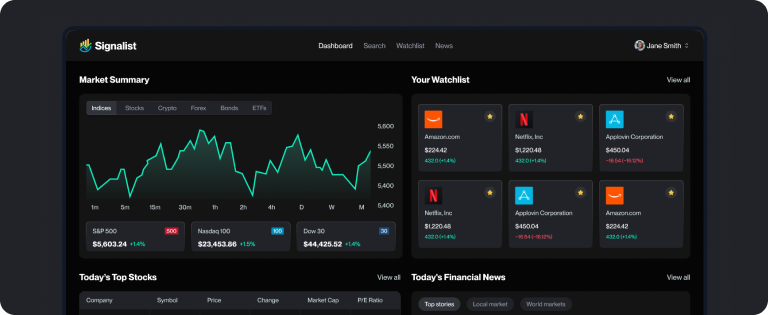
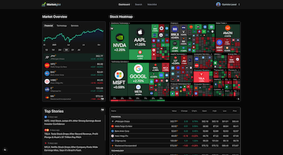
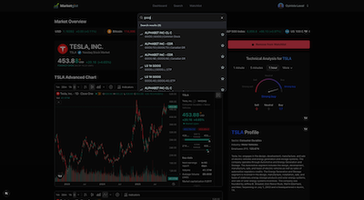
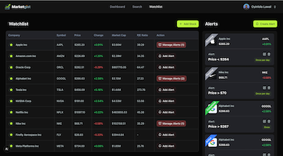
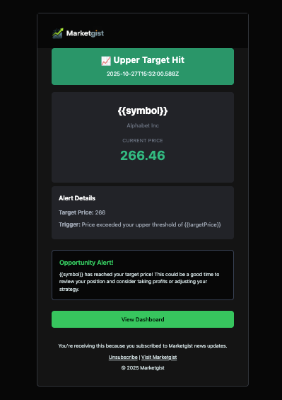
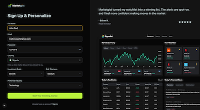
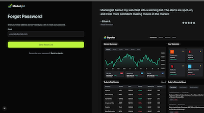
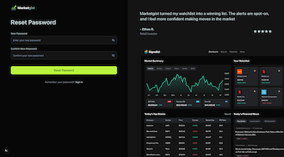

# Marketgist 📈

A comprehensive stock market tracker with AI integration, real-time charts, personalized alerts, and intelligent market insights. Built with Next.js 15, featuring dark mode, TradingView integration, and intelligent background job processing.



 

 

## ✨ Features

### Core Functionality

- **Real-time Stock Tracking**: Monitor live stock prices with TradingView integration
- **Personalized Watchlist**: Add/remove stocks and track them in real-time
- **Intelligent Price Alerts**: Set custom alerts with multiple frequency options (once, minute, hourly, daily)
- **Volume Spike Detection**: Get notified when unusual trading activity occurs
- **Market Heatmaps**: Visual representation of market performance
- **Company Profiles**: Detailed financial information and analysis
- **Search Command Palette**: Fast search for any stock symbol

### AI Integration

- **Personalized Welcome Emails**: AI-generated welcome messages based on user profile
- **Daily News Summary**: AI-powered market news summaries delivered via email
- **Sentiment Analysis**: Automated news processing and categorization

### User Experience

- **Dark Mode**: Beautiful dark theme optimized for extended viewing
- **Responsive Design**: Fully responsive across desktop, tablet, and mobile
- **Real-time Notifications**: Toast notifications for price alerts
- **Inactive User Reminders**: Automated re-engagement emails
- **Tab Visibility Detection**: Smart polling that pauses when tab is inactive

## 🛠️ Tech Stack

### Frontend

- **Next.js 15** - React framework with App Router
- **React 19** - UI library
- **TypeScript** - Type safety
- **Tailwind CSS 4** - Utility-first styling
- **Radix UI** - Accessible component primitives
- **Sonner** - Toast notifications
- **Lucide React** - Icon library
- **React Hook Form** - Form management
- **Zod** - Schema validation

### Backend & Infrastructure

- **Better Auth** - Authentication system
- **MongoDB + Mongoose** - Database and ODM
- **Inngest** - Background job processing
- **Nodemailer** - Email service
- **Finnhub API** - Stock market data

### Key Libraries

- **TradingView Widget** - Advanced charts and market tools
- **Gemini AI** - AI-powered content generation
- **Class Variance Authority** - Component styling
- **cmdk** - Command menu component

## 🏗️ Architecture

### Project Structure

```text
stocks/
├── app/                    # Next.js App Router
│   ├── (auth)/            # Authentication routes
│   ├── (root)/            # Protected routes
│   │   ├── stocks/        # Stock detail pages
│   │   └── watchlist/     # Watchlist page
│   └── api/               # API routes
│       ├── auth/          # Better Auth handlers
│       ├── notifications/ # Notification API
│       └── stocks/        # Stock data API
├── components/            # React components
│   ├── ui/               # Reusable UI components
│   └── forms/            # Form components
├── database/             # Database models
├── lib/                  # Utilities and configurations
│   ├── actions/          # Server actions
│   ├── better-auth/      # Auth configuration
│   ├── inngest/          # Background jobs
│   └── nodemailer/       # Email templates
├── hooks/                # Custom React hooks
└── types/                # TypeScript definitions
```

### Data Flow

1. **Authentication Flow**

   - User signs up/signs in → Better Auth handles session
   - Session stored in MongoDB
   - Protected routes check authentication

2. **Stock Monitoring Flow**

   - Background cron job (every 2 minutes) checks all active alerts
   - Fetches current prices from Finnhub API
   - Compares with alert thresholds
   - Atomically updates lastTriggeredAt to prevent race conditions
   - Triggers Inngest events for email notifications
   - Creates in-app notifications

3. **News Summary Flow**

   - Daily cron job (12 PM) fetches watchlist news
   - AI (Gemini) summarizes news for each user
   - Sends personalized email with market insights

4. **Watchlist Management**
   - User adds stock to watchlist
   - Stored in MongoDB with user association
   - Real-time updates via polling
   - Displays on watchlist page with analytics

## 🔐 Security Features

- **Atomic Database Operations**: Prevents race conditions in alert monitoring
- **Idempotency**: Deterministic event IDs prevent duplicate notifications
- **Concurrency Control**: Inngest concurrency limits prevent duplicate alerts
- **Optimistic Locking**: Database timestamps ensure data consistency
- **Input Validation**: Zod schemas validate all user inputs
- **SQL Injection Prevention**: Mongoose parameterized queries
- **XSS Protection**: HTML sanitization for user-generated content

## 🚀 Getting Started

### Prerequisites

- Node.js 18+
- MongoDB database
- Cloudflare account (for Inngest)
- Gmail account (for Nodemailer)

### Environment Variables

Create a `.env.local` file:

```env
# Database
MONGODB_URI=mongodb://localhost:27017/marketgist

# Better Auth
BETTER_AUTH_SECRET=your-secret-key-here
BETTER_AUTH_URL=http://localhost:3000

# Finnhub API
FINNHUB_API_KEY=your-finnhub-api-key

# Google Gemini AI
GEMINI_API_KEY=your-gemini-api-key

# Email (Nodemailer)
NODEMAILER_EMAIL=your-email@gmail.com
NODEMAILER_PASSWORD=your-app-password

# Inngest
INNGEST_EVENT_KEY=your-inngest-key
INNGEST_SIGNING_KEY=your-signing-key
INNGEST_BASE_URL=http://localhost:3000/api/inngest

# Next.js
NEXTAUTH_URL=http://localhost:3000
```

### Installation

1. **Clone the repository**

```bash
git clone https://github.com/yourusername/marketgist.git
cd marketgist
```

2. **Install dependencies**

```bash
pnpm install
```

3. **Set up the database**

```bash
pnpm run init:db
```

4. **Test database connection**

```bash
pnpm run test:db
```

5. **Run development server**

```bash
pnpm dev
```

6. **Access the application**
   - Open [http://localhost:3000](http://localhost:3000)
   - Sign up for an account
   - Start tracking stocks!

## 📸 Screenshots

### Dashboard Overview


Real-time market data with TradingView widgets, market heatmap, and top stories.

### Stock Detail Page


Advanced charting with TradingView integration, technical analysis, and comprehensive company profile.

### Watchlist & Alerts


Personalized watchlist with real-time prices and intelligent alert management.

### Email Notifications


Professional email templates for price alerts, news summaries, and user notifications.

### Authentication Pages



Beautiful and intuitive sign-up experience with comprehensive user profile setup.

### Password Reset



Secure password reset flow with email verification. Request a password reset link via email.



Complete the password reset flow using the secure token sent to your email.

## 📋 Available Scripts

- `pnpm dev` - Start development server
- `pnpm build` - Build for production
- `pnpm start` - Start production server
- `pnpm lint` - Run ESLint
- `pnpm test:db` - Test database connection
- `pnpm init:db` - Initialize database collections

## 🔄 Background Jobs

### Alert Monitoring

- **Frequency**: Every 2 minutes
- **Function**: `monitorStockAlerts`
- **Tasks**:
  - Check all active alerts
  - Fetch current prices
  - Trigger notifications when thresholds are met
  - Update lastTriggeredAt atomically

### Daily News Summary

- **Schedule**: 12:00 PM daily
- **Function**: `sendDailyNewsSummary`
- **Tasks**:
  - Fetch watchlist news for each user
  - Generate AI summaries
  - Send personalized email

### Inactive User Reminders

- **Schedule**: Weekly (Sundays at midnight)
- **Function**: `sendInactiveUserReminder`
- **Tasks**:
  - Find users inactive 30+ days
  - Send re-engagement email

## 🤝 Contributing

Contributions are welcome! Please feel free to submit a Pull Request.

## 📄 License

This project is licensed under the MIT License - see the [LICENSE](LICENSE) file for details.

## 🙏 Acknowledgments

- [TradingView](https://www.tradingview.com) - For amazing charting widgets
- [Finnhub](https://finnhub.io) - For reliable market data
- [Better Auth](https://www.better-auth.com) - For robust authentication
- [Inngest](https://www.inngest.com) - For background job processing
- [Next.js](https://nextjs.org) - For the amazing framework

---

Made with ❤️ by [Oyinlola Lawal](https://github.com/lawalOyinlola)
